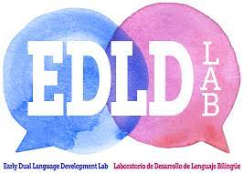

```{r setup, include=TRUE, eval=TRUE}
library(flexdashboard)
library(knitr)
library(rio)
library(tidyverse)
library(car)
library(extrafont)
library(colorblindr)
library(ggpubr)
library(cowplot)
library(scales)
library(zoo)
library(here)
#library(tcltk)
library(haven)
library(ggrepel)
library(gganimate)
library(hrbrthemes)
library(plotly)

knitr::opts_chunk$set(fig.width=12, fig.height=9, fig.align = "center", message = FALSE, error = FALSE, warning = FALSE)
```

```{r}
stex <- read.csv("~/desktop/language_proficiency/stex.csv")

require(psych)
desc <- describeBy(stex$Speaking,
                   group=list(stex$C),mat=TRUE)

desc1 <- describeBy(stex$lex,
                   group=list(stex$Sex,stex$C), mat=TRUE)
library(tidyr)
desc1 <- stex %>%
  group_by(C, Sex) %>%
  summarise(Speaking = mean(Speaking),
            morph = mean(morph),
            lex = mean(lex),
            L1 = frequency(L1),
            AoA = mean(AaA))
desc1 <- desc1 %>% drop_na()

desc1_new <- filter(desc1, C %in% c("Afghanistan", "Armenia", "Azerbaijan", "Bahrain", "Bangladesh", "Bhutan", "Brunei", "Cambodia", "China",  "Cyprus", 
"Georgia", "India", "Indonesia", "Iran", "Iraq", "Israel", 
"Japan", "Jordan", "Kazakhstan", "Kuwait", "Kyrgyzstan", "Laos", "Lebanon", 
"Malaysia", "Maldives", "Mongolia", "Myanmar", "Nepal", "North Korea", "Oman", "Pakistan", "Philippines", "Qatar", "Russia", "Saudi Arabia", "Singapore", 
"South Korea", "Sri Lanka", "Palestine", "Syria", "Tajikistan", "Thailand", 
"Timor-Leste", "Turkey", "Turkmenistan", "United Arab Emirates", "Uzbekistan"))

desc2 <- stex %>%
group_by(Family, L1) %>%
  summarize(Speaking = mean(Speaking,na.rm = T),
            feature = mean(new_feat),
            sound = mean(new_sounds))
desc2 <- desc2 %>% drop_na()

desc3 <- stex %>%
group_by(L1, Family, C) %>%
  summarize(Speaking = mean(Speaking,na.rm = T),
            feature = mean(new_feat),
            sound = mean(new_sounds))
desc3 <- desc3 %>% drop_na()

desc4 <- stex %>%
  group_by(C, Family, L2) %>%
  summarise(avg = mean(Speaking)) %>%
  arrange(desc(avg))

desc5 <- filter(desc3, L1 %in% c("Urdu", "Korean", "Spanish","Arabic","Hindi", "Persian", "Swahili", "Portugese", "Italian", "Turkish", "French", "German", "Japenese", "Russian", "Latin", "Swadesh"))

desc5 <- filter(desc5, C %in% c("Afghanistan", "Armenia", "Azerbaijan", "Bahrain", "Bangladesh", "Bhutan", "Brunei", "Cambodia", "China",  "Cyprus", 
"Georgia", "India", "Indonesia", "Iran", "Iraq", "Israel", 
"Japan", "Jordan", "Kazakhstan", "Kuwait", "Kyrgyzstan", "Laos", "Lebanon", 
"Malaysia", "Maldives", "Mongolia", "Myanmar", "Nepal", "North Korea", "Oman", "Pakistan", "Philippines", "Qatar", "Russia", "Saudi Arabia", "Singapore", 
"South Korea", "Sri Lanka", "Palestine", "Syria", "Tajikistan", "Thailand", 
"Timor-Leste", "Turkey", "Turkmenistan", "United Arab Emirates", "Uzbekistan", 
"Vietnam", "Yemen"))

desc6 <- filter(stex, C %in% c("Pakistan", "India", "Bangladesh", "Sirilanka"))
desc6 <- desc6 %>%
group_by(C, Family, L2, L1) %>%
  summarise(sounds = mean(new_sounds), 
            feature = mean(new_feat))
desc6 <- desc6 %>% drop_na()
library(viridis)
library(viridisLite)

desc7 <- stex %>%
  group_by(C, Family, L1, L2) %>%
  summarise(Speaking = mean(Speaking,na.rm = T),
            morph = mean(morph),
            lex = mean(lex),
            LoR = mean(LoR),
            AoA = mean(AaA), 
            day = mean(Edu.day),
            enroll = mean(Enroll))
desc7 <- desc7 %>% drop_na()

desc8 <- desc7 %>% 
  group_by(C, Family, sort = TRUE) %>%
  summarise(Speaking)

US <- filter(stex, C %in% "UnitedStates")
US <- US %>% 
  group_by(L1) %>%
  count()

India <- filter(stex, C %in% "India")
India <- India %>% 
  group_by(C, Family, L1, L2, sort = TRUE) %>%
  count()

UK <- filter(stex, C %in% "UnitedKingdom")
UK <- UK %>% 
  group_by(C, Family, L1, L2, sort = TRUE) %>%
  count()

Australia <- filter(stex, C %in% "Australia")
Australia <- Australia %>% 
  group_by(C, Family, L1, L2, sort = TRUE) %>%
  count()

L1 <- stex %>%
  group_by(L1) %>%
  count() %>%
  arrange(desc(n))

Sex <- stex %>%
  group_by(Sex) %>%
  count() %>%
  arrange(desc(n))

L1_new <- L1[-(16:70),]

```

Sidebar {.sidebar}
=====================================

```{r picture, echo = F, out.width = '15%', fig.align="left"}

```

Sabreen NoorAli is a second year Ph.D. student at University of Oregon studying Communication disorders and sciences. Her research interest includes bilingual language assessments and intervention from linguistically diverse population. 

This dashboard has been created as part of the final project of the data visualization course. 


About {data-icon="demmoicon.png"} 
===================================== 

#### About the data

This dataset contains information on the proficiency and linguistic characteristics of adult language learners in the Netherlands. Drawing from results collected over several decades, it is a rich source regarding the relationship between language proficiency and various individual characteristics, such as native language, country of origin, age at arrival of residence in the Netherlands, length of residence in the Netherlands, days spent on formal education in Dutch as a second language, gender identity and family status. The dataset also includes scores from sections of an exam given to assess Dutch proficiency - speaking performance score; lexical score; morphology score; and new sounds/features section. With its abundance of data points identifying vital metrics related to language learning success stories globally this invaluable resource offers an exciting opportunity to uncover previously unseen correlations

#### Purpose of Experiment

  The main goal of the current analysis is to examine language proficiency in adults learners who have moved to another country.

#### Data Collection

  52035 participants took the Dutch language proficiency test, to examine different constructs of their Dutch language ability.
  
#### Background on Second Language Acquisition

The field of second-language acquisition is regarded by some but not everybody as a sub-discipline of applied linguistics but also receives research attention from a variety of other disciplines, such as psychology and education.

A central theme in SLA research is that of inter language: the idea that the language that learners use is not simply the result of differences between the languages that they already know and the language that they are learning, but a complete language system in its own right, with its own systematic rules. This interlanguage gradually develops as learners are exposed to the targeted language. The order in which learners acquire features of their new language stays remarkably constant, even for learners with different native languages and regardless of whether they have had language instruction. However, languages that learners already know can have a significant influence on the process of learning a new one. This influence is known as language transfer. 

Demographics {data-icon="demmoicon.png"} 
===================================== 

Column
---------------------------------------------------------------
### Participants Based on Gender

```{r}

sexfig <- ggplot(Sex, aes(x = Sex, y = n)) + 
  geom_bar(stat="identity", color='skyblue',fill='steelblue') +
  theme(axis.text.x=element_text(angle=45, hjust=1)) + 
  theme(legend.position = "none") +
   labs(x = "Age of Acquistion",
       y = "Frequency")
   
   ggplotly(sexfig)
       
``` 
Column
----------------------------------------------------

### Top 15 Languages Spoken by the participants

```{r}

L1fig <- ggplot(L1_new, aes(x = L1, y = n)) + 
  geom_bar(stat="identity", color='skyblue',fill='steelblue') +
  theme(axis.text.x=element_text(angle=45, hjust=1)) + 
  theme(legend.position = "none") +
  coord_flip() + 
   labs(x = "Frequency",
       y = "Languages")
   ggplotly(L1fig)
       
``` 


Language Learning {data-icon="abilityicon.png"} 
===================================== 

Column
-----------------------------------------------------------------------

### Ability to learn new sounds

```{r}
fig3 <- ggplot(data=desc6, aes(x= C, 
                               y=sounds, 
                               color= as.factor(L1),
                               label=as.factor(L2))) +
  geom_point(size=4) +
  theme_bw() +
  labs(x = "Country", 
       y = "New Sound Acquisition Score",
       color="First langauge", 
       title="Ability to learn new language production") + 
  geom_label_repel(aes(fill = factor(L1)), colour = "white", fontface = "bold") + 
theme_minimal() +
  theme(legend.position="none",
        axis.title=element_text(size=12,face="bold"),
        axis.text=element_text(size=10),
        title=element_text(size=12))
ggplotly(fig3)
```

### Speaking scores in different countries

```{r}
fig4 <- ggplot(desc1_new, aes(x = AoA, y = Speaking, color = Sex)) +
  facet_wrap(~C) +
  geom_point() + 
  labs(title = "Association of Language Acquistion and Speaking Proficiency",
       subtitle = "How does the age of acquistion of langauge affects the verbal proficiency",
       x = "Age of Acquistion",
       y = "Speaking Scores", 
       Caption = "color = Sex") +
  theme(legend.position = "none",
        axis.title=element_text(size=12,face="bold"),
        axis.text=element_text(size=10),
        title=element_text(size=12), 
        strip.text = element_text(size = 9, margin = margin()), 
        strip.text.y = element_text(angle = 5),
        plot.caption = element_text(hjust=0.5), 
        strip.background=element_rect(colour="black",
                                    fill="#CC79A7"))

ggplotly(fig4)
```

Association {data-icon="asso.png"} 
===================================== 

Column
-----------------------------------------------------------------------------

### Association of language profieciency with 1st language 

```{r}
fig <- ggplot(data = desc5, aes(x=Speaking, y=L1)) + 
  geom_point(aes(color =Family))
ggplotly(fig)
```


### Association of langauge proficiency with Family background

```{r}
df <- as.data.frame(desc4)
df2 <- as.data.frame(desc3)
fig2 <- ggplot(data=df2, aes(x=feature, y=Family, fill=sound)) +
  geom_tile() +
  scale_fill_viridis(discrete=FALSE, option="A",
                     name="") +
  xlab("Speaking Scores")+
  ylab("Country")+
  theme(legend.position='top', panel.grid.major = element_blank(), panel.grid.minor = element_blank(),
panel.background = element_blank())
ggplotly(fig2)
```

Correlation {data-icon="asso.png"} 
===================================== 

#### Correlation between contructs of language ability

```{r cor1, echo=FALSE, fig.cap="Correlation", out.width = '100%'}
knitr::include_graphics("cor1.png")
```

#### Overall Correlation Scores

```{r cor2, echo=FALSE, fig.cap="Correlation", out.width = '100%'}
knitr::include_graphics("cor2.png")
```

The graphs on this page are referenced from Kaggle notebook by Dan Dominco. 
